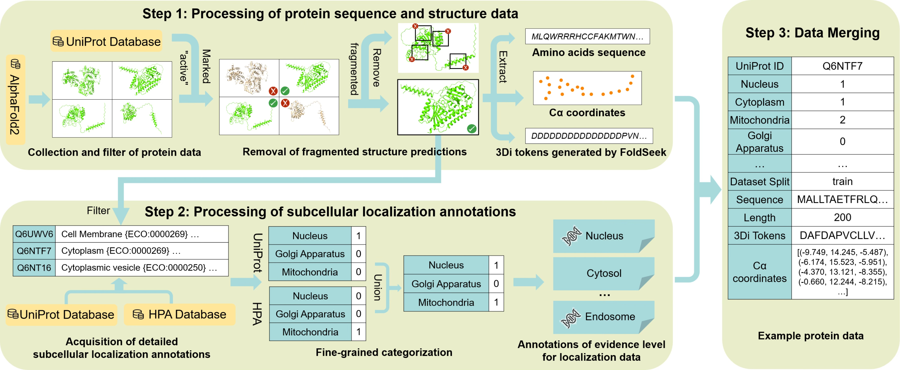

# CAPSUL: A Comprehensive Human Protein Benchmark for Subcellular Localization

[](https://opensource.org/licenses/MIT)
[](https://www.python.org/downloads/)
[](https://huggingface.co/datasets/getbetterhyccc/CAPSUL)

This repository contains the official implementation of the paper:   **"CAPSUL: A Comprehensive Human Protein Benchmark for Subcellular Localization"** *Accepted by **ICLR 2026***.



Subcellular localization is a crucial biological task for drug target identification and function annotation. Although it has been biologically realized that subcellular localization is closely associated with protein structure, no existing dataset offers comprehensive 3D structural information with detailed subcellular localization annotations, thus severely hindering the application of promising structure-based models on this task. To address this gap, we introduce a new benchmark called **CAPSUL**, a **C**omprehensive hum**A**n **P**rotein benchmark for **SU**bcellular **L**ocalization. It features a dataset that integrates diverse 3D structural representations with fine-grained subcellular localization annotations carefully curated by domain experts. We evaluate this benchmark using a variety of state-of-the-art sequence-based and structure-based models, showcasing the importance of involving structural features in this task. Furthermore, we explore reweighting and single-label classification strategies to facilitate future investigation on structure-based methods for this task. Lastly, we showcase the powerful interpretability of structure-based methods through a case study on the Golgi apparatus, where we discover a decisive localization pattern $\alpha$-helix from attention mechanisms, demonstrating the potential for bridging the gap with intuitive biological interpretability and paving the way for data-driven discoveries in cell biology.

---


## 📌 Overview

Subcellular localization is critical for understanding protein function and disease mechanisms. CAPSUL provides:
* **Diverse Baselines**: Includes sequence-based models (**ESM-2**, **ESM-C**) and structure-based models (**CDConv**, **GearNet-Edge**).
* **High-Quality Dataset**: Curated human protein data with rigorous quality control.
* **Standardized Pipeline**: Unified scripts for preprocessing, training, and evaluation.

---


## 📂 Project Structure

```text
CAPSUL/
├── dataset/            # Subcellular localization labels necessary for evaluation
├── code/               # Implementation of baseline models
│   ├── ESM             # ESM-2 and ESM-C implementation
│   ├── CDConv/         # CDConv implementation (Transformer added in accordance with the paper)
│   └── GearNet-Edge/   # GearNet-Edge implementation (Transformer added in accordance with the paper)
├── LICENSE
└── requirements.txt    # Environment dependencies
```

*Note:* The full dataset used should be downloaded at https://huggingface.co/datasets/getbetterhyccc/CAPSUL


## 🛠 Supported Baselines

- **ESM-2 / ESM-C**: Transformer-based models that learn biological patterns from massive protein sequence databases.
- **CDConv**: GCN-based model designed for 3D representations of protein backbones.
- **GearNet-Edge**: Geometry-aware Relational Graph Neural Network that captures spatial relationships and edge features of protein residues.

Please note the following regarding other baseline models mentioned in our paper: 

* **Extended Baselines**: Models such as *Graph Transformer* are provided as straightforward implementations tailored for this specific task, rather than newly developed architectures. For deep dives or specialized configurations, we encourage referring to the original repositories cited in our paper or implementing custom versions based on the provided framework. 
* **Enhanced & Fusion Models**: For models involving specific architectural improvements or hybrid approaches, such as *CDConv + Contrastive Learning* and *ESM + CDConv Fusion*, the implementations can be readily implemented by combining the provided modules in the `code/` directory.

------


## 📜 Citation

If you use this dataset and benchmark **CAPSUL** in your research, please cite:

```
Coming Soon...
```

------


## ⚖️ License

This project is licensed under the MIT License. This is a permissive license that allows for reuse, modification, and distribution for both academic and commercial purposes, provided that the original copyright and license notice are included.

See the [LICENSE](https://github.com/getbetter-hyccc/CAPSUL/blob/main/LICENSE) file for the full text.

